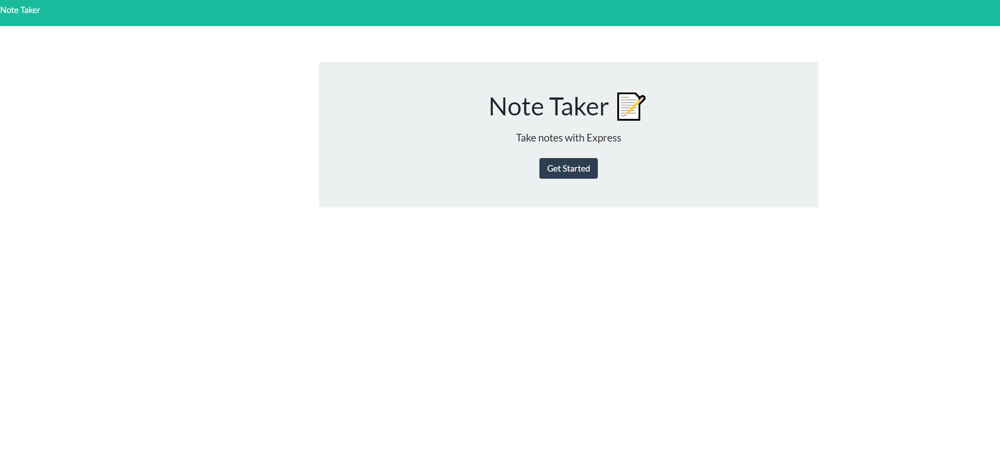
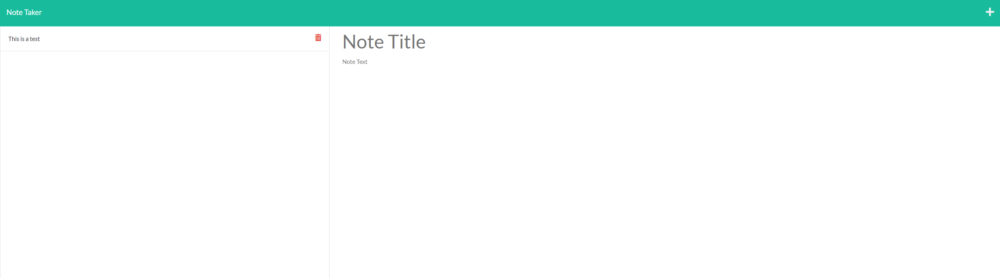
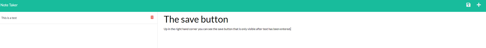

# Front to the Back Notes With Full Stack
​
## Table of Contents
​
- [Overview](#overview)
  - [The challenge](#the-challenge)
  - [User Story](#user-story)
  - [Acceptance Criteria](#acceptance-criteria)
  - [Screenshot](#screenshots)
  - [Links](#links)
- [My process](#my-process)
  - [Built with](#built-with)
  - [What I learned](#what-I-learned)
  - [Continued development](#continued-development)
  - [Useful resources](#useful-resources)
- [Author](#author)
- [Acknowledgments](#acknowledgments)
​
## Overview
​
### The challenge
​The challenge for this project was to take a preexisting project for a note taking application and debug so that the GET and POST requests work. It also needed to have working URL's and API's. For offered Extra Credit we were allowed to create a DELETE request that allowed users to delete finished notes

​
### User Story
​
```
AS A small business owner
I WANT to be able to write and save notes
SO THAT I can organize my thoughts and keep track of tasks I need to complete
```
​
### Acceptance Criteria
​
```
GIVEN a note-taking application
WHEN I open the Note Taker
THEN I am presented with a landing page with a link to a notes page
WHEN I click on the link to the notes page
THEN I am presented with a page with existing notes listed in the left-hand column, plus empty fields to enter a new note title and the note’s text in the right-hand column
WHEN I enter a new note title and the note’s text
THEN a Save icon appears in the navigation at the top of the page
WHEN I click on the Save icon
THEN the new note I have entered is saved and appears in the left-hand column with the other existing notes
WHEN I click on an existing note in the list in the left-hand column
THEN that note appears in the right-hand column
WHEN I click on the Write icon in the navigation at the top of the page
THEN I am presented with empty fields to enter a new note title and the note’s text in the right-hand column
Mock-Up
```

### Screenshots

#### The Landing Page
​

#### The Note taking page



#### Demo of the Save button



### Links
​
- [Deployed application](https://notes-with-fullstack.herokuapp.com/notes.html)
​
## My process
​
### Built with
​
- Express.js
- Postman

​
### What I learned
​
The biggest hurdle for me was getting my API's to actually give the correct requests and responses. Once I had that figured out the only hurdle remaining was destructing the params

​
### Continued development

​I would like to revisit and implement a user interface allowing people to sign in to the site and have their own profiles

​
### Useful resources
​
- [w3Schools](https://www.w3schools.com/) - Resource with great examples and navigation between different functionality
- [MDN Web Docs](https://developer.mozilla.org/en-US/docs/Learn/JavaScript) - In-depth documentation for elements or functions
- [stackoverflow](https://stackoverflow.com/) - Answered specific questions from various collaborators

## Author
​
- [James Montogmery](https://github.com/jmonty94)

## Acknowledgments

Thank you as always to Luigi Campbell my TA and my tutor Jack Linhart